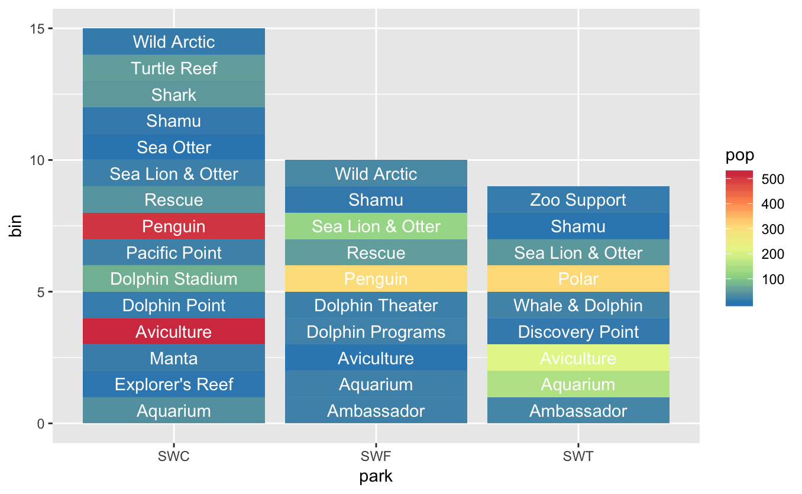
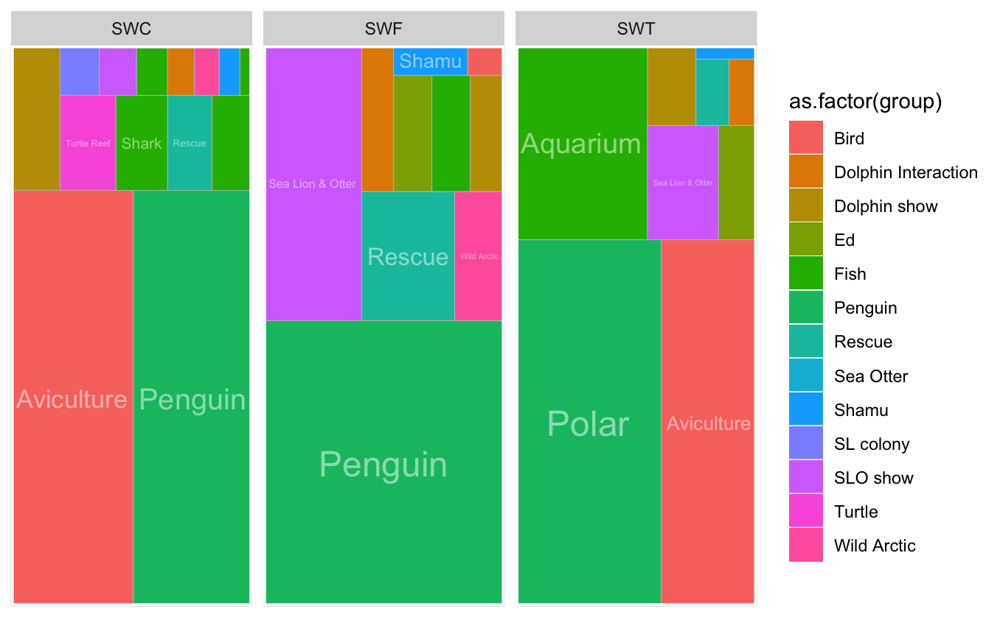
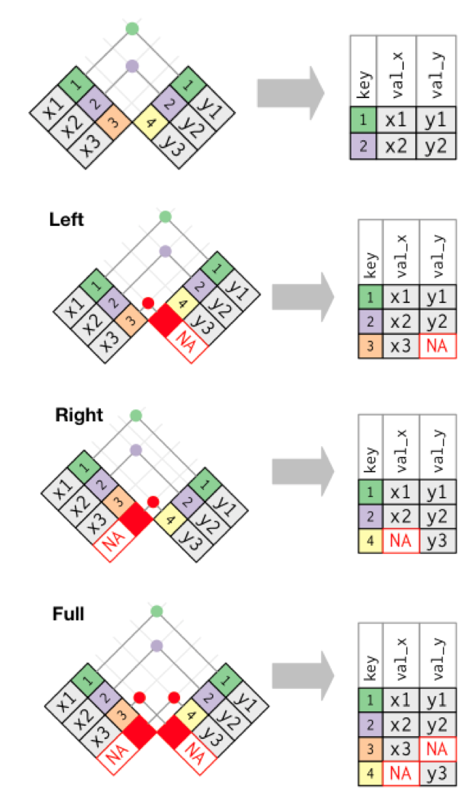
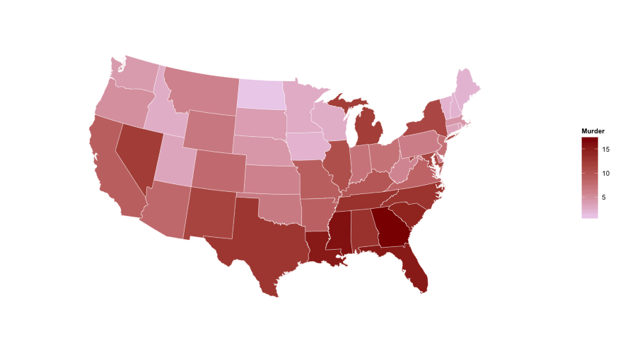

```{r setup, include=FALSE}
knitr::opts_chunk$set(echo = FALSE)
library(tidyverse)

```

## About me: Heidi Bissell
<div class="columns-2">

* Nutritional ecologist
* Using R since ~2010

* My favorite topics
      + reproducible research
      + ggplot2
      + dataviz
      
* Contact me
      + Twitter: @pandapoop42
      + http://pandapoop.net
      + heidibissell@gmail.com
      
```{r, fig.align='right', fig.cap='Heidi at work'}

```

</div>

## Option 1: Headscratcher #1: Non-geographical maps
- treemaps
- ggplot2
- dataviz
- animation?

<div class="columns-2">
```{r, fig.align='left', fig.cap='geom_bar', out.width="400px"}

```
```{r, fig.align='right', fig.cap='geom_treemap', out.width="400px"}

```
</div>

## Headscratcher #2: aligning tables by date
<div class="columns-2">

- dplyr
- tidy data

```{r, fig.align='right', fig.cap='geom_treemap', out.width="400px"}

```

</div>

## Option 3: Tidy Tuesday

- ggplot2
- geographical maps
- animation?

```{r, fig.align='center', fig.cap='heatmap', out.width="600px"}

```

## Option 1 More
I want to graph various qualitative and quantitative data in a way that people can easily compare how the same exhibit works across different parks.
- Do more people visit penguin exhibit at SWC than at SWF?
- Do we spend more on penguin health care at SWF than SWT?
- Which park gets the most attendance at Shamu shows?
- How do animal numbers compare across the areas?
- Which areas have the highest animal:staff ratios?


## Option 2 More
- What was the exchange rate for each item in a list of transactions (on the day of the transaction)?  
- Can this be done for multiple countries at once?
- I have fish nutrient composition of each fish and how much of each fish species our animals ate, and the dates that we switched to new fish lots.  What was the nutrient composition of Fluffy's diet on any given day in the past?
- I have a list of animal locations and dates they moved to those locations.  Can I figure out which animals were in SWC on a given date?

## Option 3 More
- See examples - can we recreate them?
- Can we see a difference in voter participation before/after repeal of Voting Rights Act in 2013?
- Which states have the most per capita participation?
- Which states have changed their participation rate the most?
- Are there general up or down trends?
